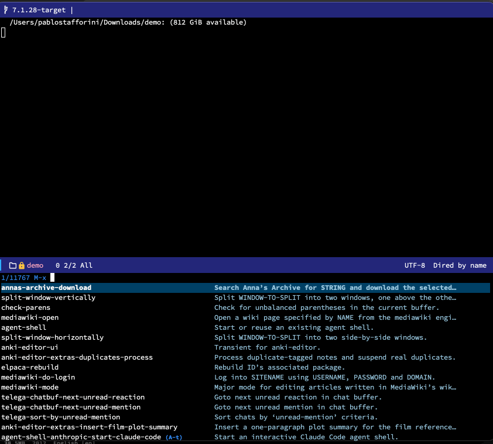

# `annas-archive`: Search and download from Anna's Archive

`annas-archive` provides Emacs integration for [Anna's Archive](https://en.wikipedia.org/wiki/Anna%27s_Archive), the largest search engine for shadow libraries. Search for books and papers by title, ISBN, or DOI, browse results in a formatted completion interface, and download files — all without leaving Emacs.



The package drives `eww` behind the scenes to load and parse search results, extracting bibliographic metadata (title, file type, size, language, year) and presenting them via `completing-read`. When you select a result, it navigates to the item page and initiates the download. For academic papers, you can search by DOI and skip straight to the download.

Two download mechanisms are available:

- **Programmatic download** via the Anna's Archive fast download API. When `annas-archive-secret-key` is set, the package calls the JSON API, retrieves the file asynchronously within Emacs, and saves it to `annas-archive-downloads-dir`.
- **External browser fallback.** When the API key is not set or a programmatic download fails, the package opens the download URL in the system's default browser.

The package depends only on libraries bundled with Emacs (`cl-lib`, `json`, `url-parse`, `url-util`, `eww`).

## Installation

### package-vc (built-in since Emacs 30)

```emacs-lisp
(use-package annas-archive
  :vc (:url "https://github.com/benthamite/annas-archive"))
```

### Elpaca

```emacs-lisp
(use-package annas-archive
  :ensure (:host github :repo "benthamite/annas-archive"))
```

### straight.el

```emacs-lisp
(use-package annas-archive
  :straight (:host github :repo "benthamite/annas-archive"))
```

## Quick start

```emacs-lisp
(use-package annas-archive
  :ensure (annas-archive :host github :repo "benthamite/annas-archive")
  :config
  ;; Optional: enable programmatic downloads (requires a paid membership)
  (setopt annas-archive-secret-key "YOUR_SECRET_KEY"))
```

Run `M-x annas-archive-download`, enter a title, ISBN, or DOI, pick a result from the completion list, and the file is downloaded.

## Documentation

For a comprehensive description of all user options, commands, and functions, see the [manual](README.org).

## License

`annas-archive` is licensed under the GPL-3. See [COPYING.txt](COPYING.txt) for details.
