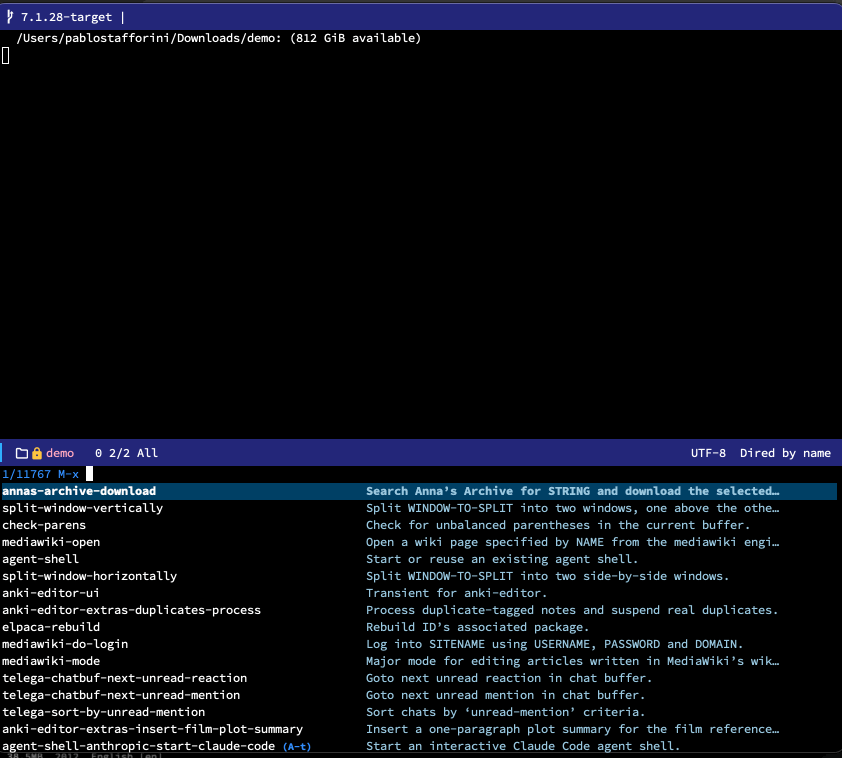

# `annas-archive`: Search and download from Anna's Archive

`annas-archive` provides Emacs integration for [Anna's Archive](https://en.wikipedia.org/wiki/Anna%27s_Archive), the largest search engine for shadow libraries. Search for books and papers by title, ISBN, or DOI, browse results in a formatted completion interface, and download files without leaving Emacs.



Anna's Archive does not provide a search-results API. The package fetches its HTML search route directly, validates the response, renders it with `shr`, and extracts the metadata needed by `completing-read`. When `annas-archive-secret-key` is set, it first creates an authenticated in-memory session so that eligible members bypass the site's browser check. It does not open an `eww` buffer or use an external browser for search. DOI queries use the journals index.

Anna's Archive sometimes returns a DDoS-Guard challenge instead of search results. `annas-archive` detects challenges, network failures, server errors, and malformed pages, then tries the configured mirrors. It reports “No results found” only for a structurally verified Anna's Archive empty-search page; a bare phrase or failed request can never become an empty result.

Two download mechanisms are available:

- **Programmatic download** via the Anna's Archive fast download API. The same `annas-archive-secret-key` used for authenticated search enables this mode. The package calls the JSON API, retrieves the file asynchronously within Emacs, and saves it to `annas-archive-downloads-dir`.
- **External browser fallback.** When the API key is not set, the package opens the selected item page in the system's default browser. It can do the same when a programmatic download fails.

The package depends only on libraries bundled with Emacs (`cl-lib`, `dom`, `json`, `shr`, `subr-x`, `url-cookie`, `url-parse`, and `url-util`).

## Installation

### package-vc (built-in since Emacs 30)

```emacs-lisp
(use-package annas-archive
  :vc (:url "https://github.com/benthamite/annas-archive"))
```

### Elpaca

```emacs-lisp
(use-package annas-archive
  :ensure (:host github :repo "benthamite/annas-archive"))
```

### straight.el

```emacs-lisp
(use-package annas-archive
  :straight (:host github :repo "benthamite/annas-archive"))
```

## Quick start

The secret key requires a paid [Anna's Archive membership](https://annas-archive.gl/donate). After you sign in, open your [account page](https://annas-archive.gl/account/), copy the secret key, and set it as shown below:

```emacs-lisp
(use-package annas-archive
  :ensure (annas-archive :host github :repo "benthamite/annas-archive")
  :config
  ;; Enable authenticated search and programmatic downloads.
  ;; This requires an eligible membership.
  (setopt annas-archive-secret-key "YOUR_SECRET_KEY"))
```

Run `M-x annas-archive-download`, enter a title, ISBN, or DOI, pick a result from the completion list, and the file is downloaded.

## Documentation

For a comprehensive description of all user options, commands, and functions, see the [manual](https://stafforini.com/notes/annas-archive/).

## License

`annas-archive` is licensed under the GPL-3. See [COPYING.txt](COPYING.txt) for details.
