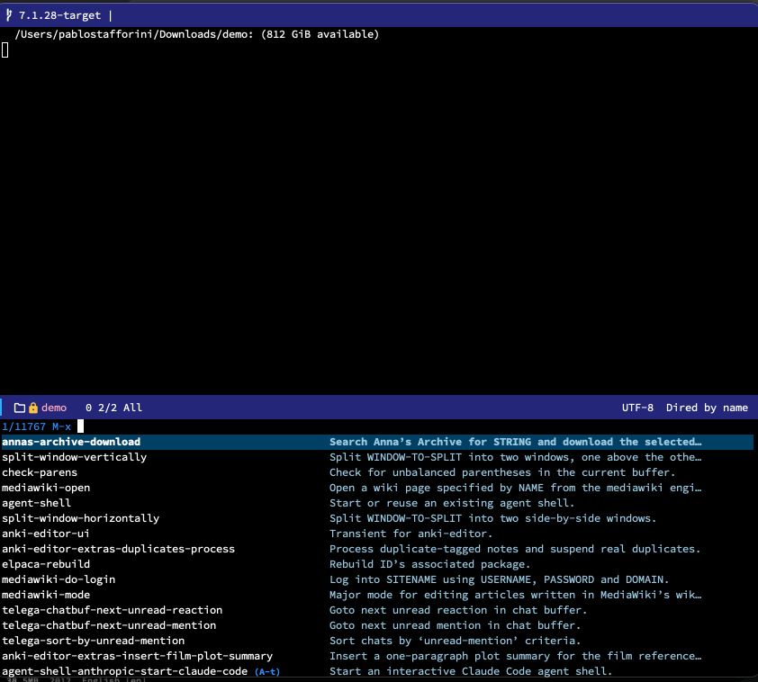

# annas-archive

## Introduction

`annas-archive` provides rudimentary Emacs integration for [Anna's Archive](https://annas-archive.li/), the largest existing search engine for shadow libraries.



## Breaking change

As of February 2026, Anna's Archive changed their download flow so that the "Download" links on item pages are now JavaScript-driven. This broke the previous `eww`-based download mechanism. Programmatic downloads now use the [fast download JSON API](https://annas-archive.li/dyn/api/fast_download.json), which requires a **secret key**.

If you were using `annas-archive-use-fast-download-links` and/or `annas-archive-use-eww`, replace them with `annas-archive-secret-key`:

```emacs-lisp
;; Before:
(setq annas-archive-use-fast-download-links t)
(setq annas-archive-use-eww t)

;; After:
(setq annas-archive-secret-key "YOUR_SECRET_KEY")
```

To find your key, log into Anna's Archive with your paid membership and visit your [account page](https://annas-archive.li/account/). Both `annas-archive-use-fast-download-links` and `annas-archive-use-eww` are now obsolete.

## Installation

### Manual

Clone this repository to your Emacs load path and add this to your `init.el` file:

```emacs-lisp
(require 'annas-archive)
```

### With `use-package`

If you use `use-package`, add one of the following snippets to your `init.el` file:

```emacs-lisp
;; with vc
(use-package annas-archive
  :vc (:url "https://github.com/benthamite/annas-archive"))

;; with elpaca
(use-package annas-archive
  :ensure (:host github :repo "benthamite/annas-archive"))

;; with straight
(use-package annas-archive
  :straight (:host github :repo "benthamite/annas-archive"))

;; with quelpa
(use-package annas-archive
  :quelpa (annas-archive :fetcher github :repo "benthamite/annas-archive"))
```

## Usage

Run `M-x annas-archive-download` and enter either:

- An ISBN or search string (e.g. title and/or author) (for books)
- A DOI (for papers).

## Configuration

### Download options

- `annas-archive-secret-key` (default: `nil`): Secret key for the Anna's Archive fast download API. When set, enables programmatic downloads directly within Emacs. A [membership](https://annas-archive.li/donate) is required. To find your key, log into your account and visit the [account page](https://annas-archive.li/account/).

- `annas-archive-when-download-fails` (default: `external`): What to do when a programmatic download fails. If `external`, download the file with the default browser. If `error`, signal an error. Otherwise, fail silently.

- `annas-archive-downloads-dir` (default: `~/Downloads/`): The directory where the downloaded files will be saved. Only relevant when `annas-archive-secret-key` is set.

- `annas-archive-post-download-hook` (default: `nil`): Hook run after downloading a file from Anna's Archive. The hook is run with the URL as its first argument and, when the file was downloaded programmatically, the destination path of the downloaded file as its second argument.

### Search options

- `annas-archive-included-file-types`: The list of file extensions to include in search results. By default, all supported file extensions are included. (To see the list of supported file types, see the variable `annas-archive-supported-file-types`.)

- `annas-archive-retry-with-all-file-types` (default: `t`): Whether to try the search again with all supported file types when the search restricted to `annas-archive-included-file-types` returns no results.

### Display options

- `annas-archive-title-column-width` (default: `100`): Width of the title column when displaying search results.
- `annas-archive-type-column-width` (default: `5`): Width of the type column when displaying search results.
- `annas-archive-size-column-width` (default: `8`): Width of the size column when displaying search results.
- `annas-archive-year-column-width` (default: `4`): Width of the year column when displaying search results.
- `annas-archive-language-column-width` (default: `20`): Width of the language column when displaying search results.

## Troubleshooting

The package has not been extensively tested. If you encounter any problems, feel free to open an issue.
